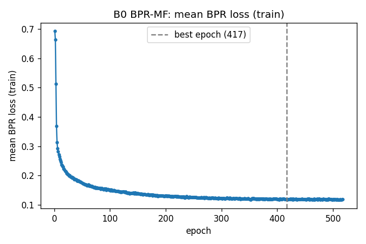
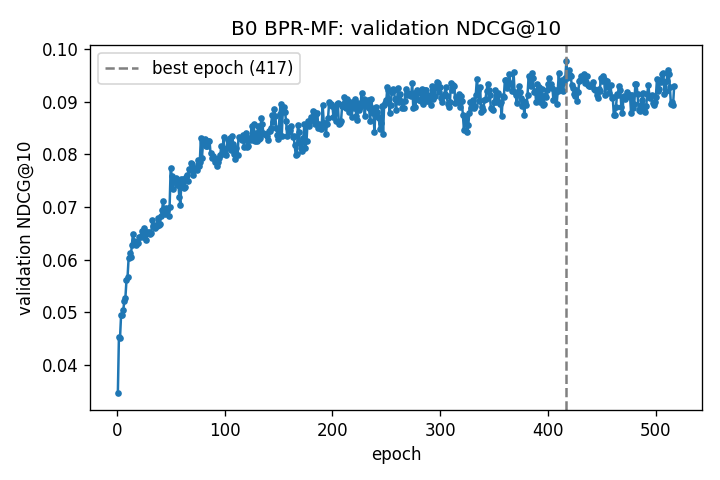

# Privacy-Preserving Federated Recommendation Systems

### Improving the Privacy–Utility–Communication Trade-off through Low-Dimensional Shared Representations

**Report 2: Phase B0 — Centralised BPR Baseline**
29 September 2026

> **Superseded in part (2026-10-02).** Under a common stopping protocol adopted for B0, B0-UW and B1 (patience = 100
> validation checks, declared before any new test evaluation), B0 was re-selected from the same search space as
> **lr 10⁻³, L2 10⁻²** (validation NDCG@10 0.0977, best epoch 417). Its test NDCG@10 over seeds 42/123/2026 is now
> **0.0860 ± 0.0005** (HR@10 0.1720 ± 0.0021, MRR@10 0.0601 ± 0.0008). The configuration, search table and results below
> (lr 5 × 10⁻⁴, L2 10⁻⁵, patience 30, test 0.0844 ± 0.0021) are kept as the historical record. Their outputs are archived in
> `results/raw/superseded_stopping_rule_2026-10-02/`. The model, loss, negative sampling, tests and methodology described
> here are unchanged. See `RESEARCH_LOG.md` (2026-10-02 entries) and `docs/B1_REPORT.md` (Sections 9, 12 and 13).

---

## Summary

B0 is the first learned model in the project: a centralised, non-private BPR matrix-factorisation
recommender with 64-dimensional user and item embeddings. It is trained and evaluated on the frozen
Phase 0 split with the same full-ranking evaluator that every later model will use. Across three
training seeds, B0 reaches a test NDCG@10 of **0.0844 ± 0.0021**, compared with 0.0443 for a popularity
ranking and 0.0038 for a random ranking. A paired per-user comparison puts B0's advantage over popularity
at +0.0402 NDCG@10 (95% bootstrap interval [0.0264, 0.0543]). Replacing each user's embedding with
another user's reduces NDCG@10 to 0.0200. The model is therefore learning user-specific preferences,
not just item popularity.

B0 is not the research contribution of the project. It is the controlled reference that the federated
(B1), private (B2), low-rank (B3) and low-rank private (B4) variants will be measured against. None of
those variants exist yet.

---

## 1. Introduction

The long-term question of this project is whether shrinking the shared part of a federated
recommender helps the trade-off between privacy, recommendation quality and communication. Answering
it requires knowing how good a recommender can be *without* any of those constraints. If a federated,
differentially private model reaches an NDCG@10 of 0.05, that number means little until we know whether
the same model trained centrally reaches 0.06 or 0.15, and whether a non-personalised popularity list
already gets 0.04.

Phase 0 built the foundation for that comparison. It fixed the MovieLens-100K preprocessing and the
implicit-feedback definition, created a deterministic chronological train/validation/test split
protected by a content fingerprint, implemented a full-ranking evaluator with unit-tested metrics, ran
random and popularity baselines, and documented the threat model. B0 is the first learned model placed
on top of that foundation. Its job is to show that the pipeline supports real personalised learning, and to
provide the centralised reference point for everything that follows.

---

## 2. Dataset and Frozen Evaluation Protocol

The data is the official MovieLens-100K release: 943 users, 1,682 movies and 100,000 ratings. A rating of 4 or
5 counts as a positive interaction (55,375 in total). Lower ratings are not positives, but they do count as
"already seen" when building candidate sets. One user with no positive ratings was removed, leaving **942
users**.

Each user's positives are ordered in time. The latest goes to test, the second-latest to validation, and the rest to
training. This gives **53,491 training positives, 942 validation positives and 942 test positives**.
Same-second ties are broken by a fixed hash of (user, item, split seed = 2026), since equal timestamps carry
no reliable order.

At evaluation time, each held-out item is ranked against every catalogue item the user had **not rated
before** that event (about 1,580 candidates on average). Metrics are NDCG@10 (primary), HR@10, Recall@10 and
MRR@10, averaged over users. With one held-out item per user, Recall@10 equals HR@10.

The split is frozen. Its content fingerprint is
`6faed6fc3d47b5b6fa638adfeea83cd7409d50c39fa01f85c10379d0daef6989`, and it was checked before and after all
B0 work. B0 uses exactly this split and the unchanged evaluator (`src/evaluate.py`), as will B1–B4.

---

## 3. Why BPR Matrix Factorisation

The task is Top-K ranking, not rating prediction. What matters is whether the held-out movie appears near the
top of about 1,580 candidates, not how accurately a star rating is predicted. Bayesian Personalized Ranking
(Rendle et al., 2009) optimises this directly. For a user *u*, a training positive *i⁺* and a sampled
non-positive item *i⁻*, it pushes the model towards

  score(u, i⁺) > score(u, i⁻),

which is a pairwise version of the ranking the evaluator measures.

Matrix factorisation was chosen as the scoring model because it is the simplest personalised model that
still captures collaborative structure, and because it splits cleanly into the two parts the federated
design needs. The user vector p_u involves only one user's data and can stay on that user's device. The item
vectors q_i are shared by everyone and are what clients would send updates for. The later low-rank experiments
change the size of exactly this shared part. BPR-MF is a standard, well-understood baseline, not a
state-of-the-art recommender, and it was chosen for that reason.

---

## 4. Model Architecture

Each user *u* has an embedding p_u ∈ ℝ⁶⁴ and each item *i* has an embedding q_i ∈ ℝ⁶⁴. The score is their
dot product:

  score(u, i) = p_uᵀ q_i

There are no bias terms, side features, genres, timestamps, content features, neural layers or attention.
Both embedding tables are initialised from a normal distribution with mean 0 and standard deviation 0.01.

| Component | Shape | Parameters |
|---|---|---|
| User embeddings | 942 × 64 | 60,288 |
| Item embeddings | 1,682 × 64 | 107,648 |
| **Total** | | **167,936** |

The dimension d = 64 is fixed. It defines the full-size reference that B3 and B4 will later shrink, so it was
not tuned.

---

## 5. BPR Objective

For a mini-batch B of triplets (u, i⁺, i⁻), the loss is

  L = (1/|B|) Σ −log σ( p_uᵀ q_{i⁺} − p_uᵀ q_{i⁻} )
    + λ · (1/|B|) Σ ( ‖p_u‖² + ‖q_{i⁺}‖² + ‖q_{i⁻}‖² ),

where σ is the logistic function and λ is the L2 coefficient. In words, the model is rewarded for scoring a
known positive above a non-positive item for the same user, and mildly penalised for large embeddings.

The first term is implemented as `softplus(s⁻ − s⁺)`, which equals −log σ(s⁺ − s⁻) but stays finite for
extreme score gaps (a unit test checks gaps of ±10⁴). The L2 penalty applies only to the embeddings in the
current batch. It is not implemented as Adam's `weight_decay`.

---

## 6. Negative Sampling

For every training positive (u, i⁺), one negative i⁻ is drawn **uniformly from all items that are not a
training positive of user u**. The draw is fresh every epoch. The sampler is built from the training
positives alone and never reads the validation set, the test set or the rating history. This has two
consequences that were accepted on purpose.

First, movies the user rated 1–3 are ordinary non-positives and can be sampled as negatives. They are not
treated as "hard" negatives or given extra weight. Because the sampler never looks at them, a low rating that
happens after the validation or test event cannot leak into training through the sampler.

Second, the user's own validation or test item can occasionally be drawn as a negative (roughly 1 in 1,600
draws). Removing it would mean looking up the held-out label during training, which is exactly the leakage the
protocol forbids. Occasionally treating a future positive as an unobserved item is the normal behaviour of
leave-out BPR.

This rule for **training negatives** is deliberately separate from the rule for **evaluation candidates**. At
evaluation time, every item the user has rated before the held-out event is removed from the candidate list,
because a real system would not recommend a film the user has already seen. Training asks "which items are not
known positives?", while evaluation asks "which items are still worth recommending?"

---

## 7. Training Configuration

The frozen configuration, read from `configs/b0.yaml`:

| Setting | Value |
|---|---|
| Embedding dimension | 64 |
| Initialisation | N(0, 0.01²) |
| Optimiser | Adam |
| Learning rate | 5 × 10⁻⁴ |
| L2 coefficient λ | 1 × 10⁻⁵ |
| Batch size | 1,024 |
| Negatives per positive | 1 |
| Maximum epochs | 600 |
| Early stopping | patience 30 on validation NDCG@10 |
| Hardware / determinism | CPU, 4 threads, `torch.use_deterministic_algorithms(True)` |

After every epoch, validation NDCG@10 is computed with the frozen evaluator. The weights from the best
validation epoch are kept and restored at the end. The test set is scored **once**, on those restored weights,
after training has finished. Neither the training loop nor the hyperparameter search ever evaluates test data.

---

## 8. Hyperparameter Search

The search varied only the learning rate and the L2 coefficient, with seed 42, d = 64 and batch size 1,024. It
ran in two declared stages. Stage 1 was a 3 × 3 grid (learning rate 10⁻², 5 × 10⁻³, 10⁻³; L2 10⁻⁴, 10⁻⁵, 0).
Stage 1 showed that L2 values of 10⁻⁴ and below made almost no difference: 10⁻⁵ and 0 even gave identical
scores. It also showed the best learning rate sitting at the smallest value tried. Stage 2 therefore added five
runs covering stronger L2 (10⁻³, 10⁻²) and a smaller learning rate (5 × 10⁻⁴). Stage 2 was declared as the last
stage before it was run.

Table 1 gives all 14 runs under the final protocol (maximum 600 epochs, patience 30). Every run ended by early
stopping.

**Table 1. Validation-only search (seed 42), sorted by validation NDCG@10.**

| Learning rate | L2 | Best epoch | Epochs run | Val NDCG@10 | Val HR@10 | Val MRR@10 |
|---|---|---:|---:|---:|---:|---:|
| **5e-4** | **1e-5** | **296** | **326** | **0.0963** | 0.1783 | 0.0717 |
| 5e-4 | 1e-3 | 267 | 297 | 0.0951 | 0.1858 | 0.0681 |
| 1e-3 | 1e-4 | 148 | 178 | 0.0941 | 0.1741 | 0.0700 |
| 1e-3 | 1e-3 | 153 | 183 | 0.0939 | 0.1699 | 0.0709 |
| 1e-3 | 1e-5 | 150 | 180 | 0.0938 | 0.1741 | 0.0697 |
| 1e-3 | 0 | 150 | 180 | 0.0938 | 0.1741 | 0.0697 |
| 5e-3 | 1e-4 | 71 | 101 | 0.0906 | 0.1645 | 0.0685 |
| 5e-3 | 1e-5 | 71 | 101 | 0.0905 | 0.1667 | 0.0680 |
| 5e-3 | 0 | 71 | 101 | 0.0901 | 0.1667 | 0.0674 |
| 1e-3 | 1e-2 | 152 | 182 | 0.0895 | 0.1656 | 0.0668 |
| 5e-4 | 1e-2 | 155 | 185 | 0.0825 | 0.1603 | 0.0590 |
| 1e-2 | 1e-5 | 6 | 36 | 0.0793 | 0.1571 | 0.0564 |
| 1e-2 | 0 | 6 | 36 | 0.0793 | 0.1571 | 0.0564 |
| 1e-2 | 1e-4 | 6 | 36 | 0.0792 | 0.1561 | 0.0565 |

Two patterns stand out. Smaller learning rates train more slowly but end slightly higher. The largest rate
(10⁻²) peaks at epoch 6 and then overfits. L2 only matters once it reaches 10⁻², and at that point it hurts.
The top six configurations are all within 0.0025 NDCG@10 of each other, while the per-user standard error of
validation NDCG@10 is about 0.0076. On validation, these configurations cannot be told apart statistically.

The search protocol itself changed twice while B0 was developed, both times before any test evaluation. With
the original early-stopping patience of 10, runs often stopped while still improving: epoch-to-epoch
validation noise (about ±0.003) was much larger than the late-stage improvement (about 0.0002 per epoch).
Patience was raised to 30 and the whole search was re-run. The second change, the epoch budget, is described
next.

---

## 9. Convergence Check and the B0 Revision

With a 300-epoch budget, the configuration with the highest validation score (learning rate 5 × 10⁻⁴, L2 10⁻⁵)
reached its best at epoch 296 and was stopped by the cap at epoch 300, before early stopping had time to
confirm the peak. The first version of B0 dealt with this by excluding runs that hit the cap and selecting the
next-best configuration (L2 10⁻³, validation NDCG@10 0.0951). That rule turned out to be hard to justify.
Hitting a budget does not make a configuration invalid. It only means its optimum had not yet been
established.

A validation-only convergence check was therefore run on that configuration, using the same seed, split,
evaluator and patience, and a maximum of 600 epochs. The test set was not used. Before running it, two outcomes
were written down. If the run early-stopped before 600 epochs, it would be selected by plain validation
argmax. If it hit 600 again, the existing choice would stand.

Because training is deterministic, the first 300 epochs repeated exactly, which was verified. The best epoch
stayed at **296**, with validation NDCG@10 **0.0963**, and early stopping triggered at **epoch 326**. After
the peak, validation NDCG@10 flattened and then dropped (0.0939 at epoch 300, 0.0950 at 310, 0.0946 at 320,
0.0922 at 326). The 300-epoch cap had ended the run four epochs before patience would have confirmed
convergence.

The protocol was corrected by raising the budget to 600 epochs for all configurations and re-running the full
search. Since every other configuration had already early-stopped well before 300 epochs, exactly one row of
the search changed. The larger budget turned out to matter beyond the search as well. In the multi-seed runs,
seed 2026 reached its best at epoch **311**, so it too would have been cut off under the old cap.

---

## 10. Model Selection Rule

The final rule is simple: **select the configuration with the highest validation NDCG@10.** Exact ties would go
to the larger L2, but none occurred at the top. No test metric plays any part. The earlier rule that excluded
capped runs has been removed. Instead, the search code now stops with an error if the winning configuration
hits the epoch cap, so a censored run can never be selected or quietly skipped.

Under this rule, the frozen B0 configuration is **learning rate 5 × 10⁻⁴, L2 10⁻⁵**, with the settings in
Section 7.

---

## 11. Training Behaviour

*Figure 1. Seed 42 with the frozen configuration: mean training BPR loss (top) and validation NDCG@10 (bottom)
per epoch. The dashed line marks the selected epoch (296).*

All three seeds start at a BPR loss of 0.6931 (= ln 2, the value when all scores are near zero) and fall
steadily. The loss keeps decreasing after the best validation epoch, which is the usual sign that further
training mostly fits the training set. Validation NDCG@10 rises quickly at first. It passes the popularity
baseline's validation score (0.0464) at epoch 5–7 and reaches about 0.063–0.071 by epoch 50. It then climbs
slowly for a few hundred epochs, with noticeable noise from epoch to epoch.

**Table 2. Per-seed training behaviour.**

| Seed | Best epoch | Epochs run | BPR loss at best epoch | Val NDCG@10 at best | Epoch passing popularity |
|---|---:|---:|---:|---:|---:|
| 42 | 296 | 326 | 0.0470 | 0.0963 | 7 |
| 123 | 162 | 192 | 0.0932 | 0.0871 | 7 |
| 2026 | 311 | 341 | 0.0436 | 0.0973 | 5 |

How long training takes varies a lot between seeds (best epoch 162 to 311). Seed 123 peaks much earlier and
lower. Training takes about 0.06 seconds per epoch on CPU, so a full run takes about two minutes, including
per-epoch validation.

---

## 12. Random and Popularity Baselines

The two Phase 0 baselines give the reference points on the same test protocol. The random ranking (seed 42) is
the lower sanity bound. With about 1,580 candidates, a random list puts the target in the top 10 less than 1%
of the time. The popularity ranking scores every item by its number of training positives and shows every user
the same list. It is the natural non-personalised baseline. B0 is the first model that ranks items differently
for different users.

---

## 13. Final B0 Results

**Table 3. Test results. B0 is mean ± standard deviation over training seeds 42, 123 and 2026.**

| Model | NDCG@10 | HR@10 | Recall@10 | MRR@10 |
|---|---:|---:|---:|---:|
| Random | 0.0038 | 0.0085 | 0.0085 | 0.0024 |
| Popularity | 0.0443 | 0.0870 | 0.0870 | 0.0314 |
| **B0 BPR-MF** | **0.0844 ± 0.0021** | **0.1674 ± 0.0025** | **0.1674 ± 0.0025** | **0.0594 ± 0.0034** |

On validation, B0 scores 0.0935 ± 0.0056 NDCG@10, HR@10 0.1769 ± 0.0025 and MRR@10 0.0685 ± 0.0066. Test
scores are lower than validation for every seed. Part of this gap is expected for seed 42 (Section 20).

Under identical full-ranking evaluation, B0 roughly doubles popularity on all three metrics. In absolute terms,
about 17% of test targets land in the top 10 out of roughly 1,580 candidates. That is modest, but it is
typical of strict chronological leave-last-out evaluation with full ranking and already-seen items removed.
None of this makes B0 a state-of-the-art recommender, and it was not meant to be one.

---

## 14. Paired User-Level Comparison

Because every model is scored on the same 942 users with the same candidate sets, B0 and popularity can be
compared user by user. For each user, the difference in test NDCG@10 was computed between B0 (averaged over the
three seeds) and popularity. The users were then resampled 10,000 times to get a bootstrap interval for the mean
difference.

The mean per-user difference is **+0.0402**, with a **95% bootstrap interval of [+0.0264, +0.0543]**. B0 does
better for 179 users, worse for 63, and equally for 700. Most of the equal cases are users for whom neither
method places the target in the top 10. The interval is well above zero, so the improvement over popularity is
not an artefact of a few users or of seed noise. This is a single paired comparison on one dataset. It is not a
general significance claim.

---

## 15. Personalisation Sanity Check

A model can beat popularity without really personalising, for example by learning a better global ranking. To
test this, the trained seed-42 model was re-scored on test with its user embeddings altered and the item
embeddings kept fixed:

| User vector used for scoring | Test NDCG@10 |
|---|---:|
| The user's own embedding p_u | 0.0841 |
| Another user's embedding (random permutation of users) | 0.0200 |
| The average of all user embeddings | 0.0514 |

If B0 were mainly encoding popularity in the item vectors, swapping user vectors would change little. Instead,
giving a user someone else's vector cuts NDCG@10 by about three quarters, well below popularity. A single
"average user" performs about as well as the popularity list (0.0514 vs 0.0443). So the gain above popularity
comes from the individual user embeddings. This matters for the planned federated design, where p_u stays on the
user's device: the part of the model that makes recommendations personal is exactly the part that will not be
shared. This check says nothing about privacy. Keeping p_u local does not by itself protect the user.

---

## 16. Multi-Seed Stability

Across the three seeds, test NDCG@10 is 0.0841 (seed 42), 0.0825 (123) and 0.0867 (2026). The standard deviation
is 0.0021, compared with a per-user standard error of about 0.007 within a single run. Seed-to-seed variation is
therefore present but modest, and all three seeds are far above popularity. The larger variation is in the
*stopping point* (Table 2). Three seeds is only a preliminary check. The research log already commits the
headline comparisons of B0–B4 to at least five training seeds, with paired per-user analysis, because the
differences expected between federated, private and low-rank variants may be of the same order as this seed
variation.

---

## 17. Superseded Configuration

For completeness, the first version of B0 used L2 = 10⁻³, chosen under the temporary "exclude capped runs"
rule with a 300-epoch budget. Across the same three seeds it scored 0.0856 ± 0.0040 test NDCG@10. After the
budget was extended and the capped run turned out to converge, L2 = 10⁻⁵ became the highest-validation
configuration and replaced it. The old outputs (search table, per-seed and per-user results, checkpoints and
plots) are archived in `results/raw/superseded_b0_lr5e-4_l2_1e-3/` rather than deleted, because their test
numbers had already been reported.

The superseded configuration's test score is slightly higher (0.0856 vs 0.0844). It was still not reinstated. The
final configuration was chosen on validation. Switching back because of a test number would be selecting on the
test set, which undermines the one estimate the test set is supposed to give. The paired per-user difference
between the two, final minus superseded, is **−0.0012 with a 95% interval of [−0.0040, +0.0016]**. It cannot be
distinguished from zero. The revision changed how the configuration is justified, not how well B0 performs.

---

## 18. Reproducibility

Several controls make B0 reproducible and traceable:

- **Data:** the split is fixed by `configs/dataset.yaml` and its content fingerprint. The raw `u.data` file is
  checked against a pinned SHA-256 on every load, and the raw directory was confirmed unchanged after all runs.
- **Configuration:** every B0 setting is in `configs/b0.yaml`. The model-training seed is separate from the split
  seed, and a test confirms that training seeds cannot change the split.
- **Checkpoints:** each checkpoint (`checkpoints/b0_best.pt` and one per seed) stores the weights, the full model
  and dataset configurations, the seed, the best epoch, the validation metrics, the PyTorch version and the split
  fingerprint. The loader uses PyTorch's safe weights-only mode and refuses a checkpoint whose fingerprint does not
  match the current split. Reloading `b0_best.pt` reproduces test NDCG@10 = 0.084091 exactly.
- **Determinism within the working environment:** training runs on CPU with a fixed thread count and deterministic
  algorithms. Re-running the search reproduced all unchanged rows exactly. The 600-epoch convergence check
  reproduced the first 300 epochs of the original run exactly. The standalone command
  `python experiments/run_b0.py --config configs/b0.yaml --seed 42` produced a result file byte-identical to the
  seed-42 file from the multi-seed run. Apart from wall-clock timing, these repeated runs were byte-identical.
- **Fresh environment:** the code, configuration and raw data were copied to a new directory with a new virtual
  environment built from `requirements.txt`. Preprocessing, both baselines and the three B0 seeds were re-run there, and
  all 54 tests passed. The split, the baselines and seeds 123 and 2026 (checkpoints, results, per-user files) were
  byte-identical to the main repository. **Seed 42 was not.** Its training loss first differed in the sixth decimal at
  epoch 13, and the final weights differ by a relative 7.8 × 10⁻⁶ (largest single difference 5 × 10⁻⁵). The best
  epoch (296) and every reported metric (NDCG@10, HR@10, Recall@10, MRR@10, on both validation and test) are identical
  to six decimals. The only visible effect is one validation user whose target moved from rank 596 to 595, far outside
  the top 10.

  Library versions, hardware, thread count and the determinism flag were the same in both environments, so the most
  likely cause is float32 matrix kernels (Intel MKL) whose rounding can depend on memory alignment, which PyTorch's
  deterministic mode does not control. This has not been verified. The accurate claim for B0 is therefore
  **"reproducible to the reported precision, and bit-identical in most but not all runs"**, not strict bit-level
  reproducibility. Setting MKL's conditional numerical reproducibility mode (`MKL_CBWR`) is the likely fix and should
  be evaluated before B1. It was not applied here, because this phase does not modify code.

---

## 19. Automated Testing

The test suite has **54 tests, all passing**: the 43 Phase 0 tests, unchanged, plus 11 new tests in
`tests/test_bpr.py`:

1. output and embedding shapes and the parameter count;
2. scores equal hand-computed dot products;
3. the BPR loss matches a hand-computed value and stays finite for extreme score gaps;
4. gradients reach exactly the user and item rows in the batch, and no others;
5. the negative sampler never returns a training positive of that user;
6. the loss falls by more than half on a toy dataset;
7. on the toy dataset (user 0 likes items 0 and 1, user 1 likes items 2 and 3), each user's liked items end up ranked
   above every other item;
8. the same seed gives identical weights and losses, and a different seed does not;
9. the split fingerprint is unchanged;
10. a spy on every training batch of a real MovieLens epoch confirms that the positives used are exactly the
    training pairs, that no validation or test positive is used as a positive, and that no negative is a training
    positive;
11. the saved checkpoint carries the frozen split's fingerprint, and loading it against a modified split is
    rejected.

These tests are there to rule out the most common ways a recommender can look better than it is: leaked
held-out items, index mix-ups between users and items, and an evaluator scoring the wrong rows. Together with
the personalisation check, they make it unlikely that B0's advantage over popularity comes from a bug.

---

## 20. Problems Encountered

**L2 scale.** In this loss, L2 coefficients of 10⁻⁴ and below had no measurable effect, so the first grid
effectively searched the learning rate only. Stage 2 was added to cover stronger values. L2 started to matter at
10⁻², where it lowered accuracy.

**Early-stopping patience.** Patience 10 stopped runs on noise, because validation NDCG@10 fluctuates by about ±0.003
between epochs while late-stage improvement is about 0.0002 per epoch. Patience was raised to 30 and the search
re-run. The patience-10 table is kept in `results/raw/b0_search/`.

**Epoch cap.** A 300-epoch cap cut off the best configuration just before convergence could be confirmed. It
was resolved by the convergence check in Section 9 and a 600-epoch budget.

**Seed-dependent stopping.** The best epoch ranged from 162 to 311 across seeds. Round and epoch budgets for later
phases will need similar headroom.

**Validation-selection bias.** Seed 42 was used both for the search and as a reported seed. Its validation score
(0.0963) is therefore optimistic and should not be read as an estimate of generalisation. The test set, and seeds
123 and 2026, were not involved in selection.

**Checkpoint metadata.** The first checkpoints stored the PyTorch version as a `TorchVersion` object, which the
safe weights-only loader rejects. It is now stored as a string, and the checkpoints were regenerated by re-running
training. The metric outputs were byte-identical, so model behaviour was unaffected.

**Cross-environment floating-point differences.** A fresh-environment rerun showed that seed 42's weights can differ
in the last bits between runs (Section 18), even with PyTorch's deterministic mode. Reported metrics were unaffected.
It is recorded here because it corrects an earlier, stronger reproducibility claim in the research log.

---

## 21. Limitations of B0

These points define what B0 can and cannot tell us. They are not failures of the phase.

- MovieLens-100K is small, and only one dataset has been used so far. MovieLens-1M is kept for a later
  generalisation check.
- BPR-MF is a simple latent-factor model. Stronger recommenders exist, and B0 is not meant to compete with them.
- Only positive implicit feedback is modelled. Negative sampling treats every non-positive item, including
  unrated ones, as a candidate negative, although many of them are simply unseen rather than disliked.
- Only three training seeds have been run so far.
- B0 is trained centrally on all users' data. It offers no privacy guarantee and does not address the privacy
  problem. It shows what is achievable when privacy is ignored.

---

## 22. What B0 Establishes

B0 establishes that:

1. the frozen evaluation pipeline supports meaningful personalised recommendation;
2. BPR substantially outperforms both random and popularity rankings under identical full-ranking evaluation,
   and the paired per-user advantage over popularity has an interval well above zero;
3. the improvement comes from the user-specific embeddings, the part of the model that will stay on the device in
   the federated design;
4. results are reproducible to the reported precision (bit-identical in most runs, with rare last-bit float
   differences), and the configuration was chosen on validation alone under a rule that is now enforced in code;
5. a reference level of about **0.084 test NDCG@10** is available for interpreting B1–B4.

---

## 23. Next Step

The next phase, B1, will move the same BPR-MF model into a federated setting. User embeddings will stay local and
item-embedding updates will be aggregated, with the same split, evaluator, metrics and statistical plan. B0's
learning rate and L2 were tuned for centralised Adam training and will not be copied over without their own
validation-based tuning. Nothing about B1 has been implemented yet.

---

## 24. Conclusion

Phase B0 added the first learned model to the project and checked it carefully. A plain 64-dimensional BPR matrix
factorisation, trained centrally on the frozen split, reaches a test NDCG@10 of 0.0844 ± 0.0021 across three
seeds. That is about twice the popularity baseline, and the gain disappears when user vectors are swapped. The phase
also improved the protocol: the early-stopping patience, the epoch budget and the model-selection rule were
corrected before any test evaluation influenced them. With B0 frozen, the centralised reference is in place, and
the federated and private variants can now be measured against it on equal terms.

---

### References

S. Rendle, C. Freudenthaler, Z. Gantner and L. Schmidt-Thieme. *BPR: Bayesian Personalized Ranking from Implicit
Feedback.* UAI 2009.

W. Krichene and S. Rendle. *On Sampled Metrics for Item Recommendation.* KDD 2020.

### Appendix: Files

| Content | Location |
|---|---|
| Model, loss, sampler | `src/bpr.py` |
| Training loop | `src/train_bpr.py` |
| Experiment runner | `experiments/run_b0.py` |
| Frozen configuration | `configs/b0.yaml` |
| Search results | `results/b0_hyperparameter_search.csv`, `results/raw/b0_search/` |
| Seed-42 results | `results/b0_validation_results.csv`, `results/b0_test_results.csv`, `results/b0_per_user_test.csv`, `results/b0_training_history.csv` |
| Multi-seed results | `results/raw/b0_seed{42,123,2026}.csv`, `results/b0_summary.csv`, `results/b0_comparison.csv` |
| Diagnostics | `results/raw/b0_diagnostics.txt` |
| Checkpoints | `checkpoints/b0_best.pt`, `checkpoints/b0_seed{42,123,2026}.pt` |
| Superseded outputs | `results/raw/superseded_b0_lr5e-4_l2_1e-3/` |
| Decision record | `RESEARCH_LOG.md` (Phase B0 and Phase B0 revision) |
