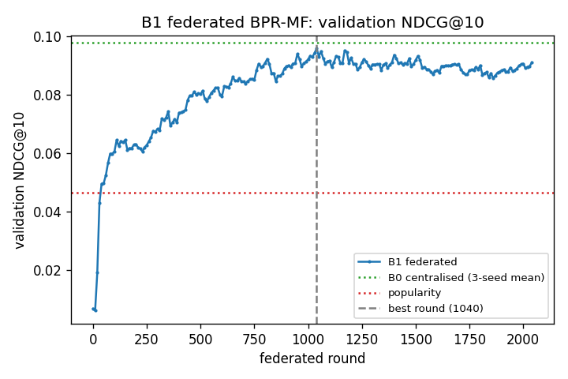
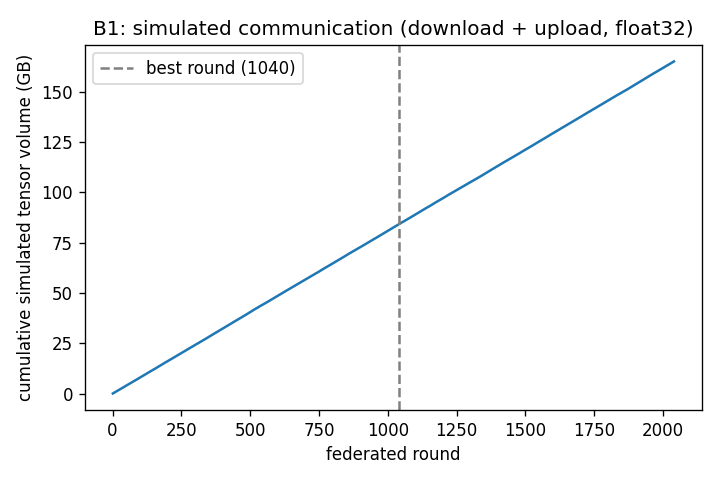

# Privacy-Preserving Federated Recommendation Systems

### Improving the Privacy–Utility–Communication Trade-off through Low-Dimensional Shared Representations

**Report 3: Phase B1 — Federated BPR without Differential Privacy**
2 October 2026 (revised the same day: user-weighted control and common stopping protocol)

---

## Summary

B1 converts the centralised BPR matrix-factorisation baseline (B0) into a simulated cross-device federated
system. Each of the 942 MovieLens-100K users is a client that keeps its own 64-dimensional user vector on the
device. Only the 1,682 × 64 item matrix is shared. In each round, about 10% of clients are sampled at random.
They train locally on their own interactions and send back an update to the item matrix, and the server
averages these updates with equal weight per client. There is no differential privacy, no clipping and no noise.
The purpose of B1 is to measure what federation alone does to recommendation quality, so that the effect of DP
in B2 can be separated from it.

Going from B0 to B1 changes two things at once: training becomes federated, and the objective changes from
weighting every *interaction* equally to weighting every *user* equally. To separate the two, a centralised
user-weighted control (**B0-UW**) was trained with B0's hyperparameters. All three models were re-selected under one
common stopping protocol before any test evaluation. Over three training seeds, test NDCG@10 is:

- B0 (centralised, interaction-weighted): **0.0860 ± 0.0005**;
- B0-UW (centralised, user-weighted): **0.0917 ± 0.0019**;
- B1 (federated, user-weighted): **0.0875 ± 0.0021**.

Paired per user:
- the weighting change is worth **+0.0058** (95% bootstrap interval [−0.0002, +0.0119]), concentrated in
  low-activity users;
- federation at the same weighting costs **−0.0042** ([−0.0109, +0.0023]);
- the total change from B0 to B1 is **+0.0016** ([−0.0054, +0.0087]).

B1's parity with B0 is therefore partly a weighting effect. Against the like-for-like control, federation retains
**95%** of NDCG@10, a gap that this design cannot distinguish from zero. Personalisation survives federation:
replacing each user's vector with another user's drops B1's test NDCG@10 from 0.0890 to 0.0202. Each participating
client exchanges 0.86 MB of float32 tensors per round. The selected seed-42 run used 84 GB of simulated tensor volume
up to its best round.

---

## 1. Introduction

The project asks whether shrinking the shared part of a private federated recommender improves the balance
between privacy, recommendation quality and communication. That question involves three changes relative to
ordinary centralised training: federation, differential privacy, and a smaller shared representation. If they
were introduced together, a drop in quality could not be attributed to any one of them. The project therefore
adds them one at a time.

B0 established the centralised reference: a plain BPR-MF model with d = 64 (0.0860 test NDCG@10 under the revised
protocol of Section 9). B1
adds federation. It keeps B0's model, per-example loss, negative-sampling rule, dimension, data split, candidate
sets and evaluator. What changes is who holds which parameters, how training is organised in rounds, and what is
communicated.

Federation also brings **a second, less obvious change: how users are weighted in the training objective**. B0
averages over all training interactions, so a user with 300 positives contributes about 100 times as much training
signal as a user with 3. In B1, each client averages its loss over its own interactions, and the server then
averages clients with equal weight, so every participating user counts about equally. B0 → B1 is therefore
*federation plus a change from interaction weighting to user weighting*. A difference between B1 and B0 cannot be
read as a pure federation effect. Section 13 separates the two with a centralised, user-weighted control model
(B0-UW). None of these differences is a privacy cost, because B1 provides no privacy guarantee.

---

## 2. Frozen Protocol and the B0 Reference

Nothing from Phase 0 was modified. B0 was re-selected under the common stopping protocol described in Section 9.
The earlier B0 configuration and results are archived, not deleted.

- **Data and split:** MovieLens-100K. A rating ≥ 4 counts as a positive. 942 users are retained. Training,
  validation and test hold 53,491, 942 and 942 positives, from a chronological leave-two-out split with split seed
  2026. The split fingerprint `6faed6fc3d47…6989` was verified before and after B1.
- **Evaluation:** full ranking against every item the user has not rated before the held-out event. NDCG@10 is the
  primary metric, with HR@10, Recall@10 (equal to HR@10 here) and MRR@10. The evaluator is the unchanged
  `src/evaluate.py`.
- **B0 reference (revised):** Adam, lr 10⁻³, L2 10⁻², patience 100 epochs. Over 3 seeds: test NDCG@10 0.0860 ± 0.0005,
  HR@10 0.1720 ± 0.0021, MRR@10 0.0601 ± 0.0008.
- **B0-UW control:** identical to B0, except that each training example is drawn as a uniform user and then a uniform
  positive of that user. The expected loss is therefore (1/N) Σ_u (1/n_u) Σ_k L_{u,k}, the equal-user objective that B1's
  aggregation optimises, rather than B0's interaction-weighted (1/Σ_u n_u) Σ_u Σ_k L_{u,k}. Drawing examples is
  used instead of reweighting them, because a 1/n_u weight would give a user with a single positive about 57 times the
  average weight and make the gradients very noisy. B0-UW is a strict one-factor control: it is not retuned.

---

## 3. Federated Architecture

Each retained user is one client. Its parameters are divided as follows:

| | Held by | Shape | Sent over the network? |
|---|---|---|---|
| User vector p_u | the client | 64 | never |
| Training positives of u | the client | n_u items | never |
| Item matrix Q | the server (global) | 1,682 × 64 | downloaded by every selected client |
| Item update ΔQ_u | computed by the client | 1,682 × 64 | uploaded to the server |

The score is unchanged from B0: score(u, i) = p_uᵀ q_i. The user vector persists across rounds. It is updated only
when its client participates, it is never averaged with other users, and it is never reset during a run. Both P and
Q start from exactly the same random values as B0 for the same seed, so B0 and B1 begin from an identical model and
differ only in how it is trained.

```text
                        SERVER: global item matrix Q_t
                  /                   |                    \
           download Q_t          download Q_t          download Q_t
                |                     |                     |
         client u1 (sampled)   client u2 (sampled)   client u3 (sampled)
         local p_u1, history   local p_u2, history   local p_u3, history
         local BPR (E steps)   local BPR (E steps)   local BPR (E steps)
                |                     |                     |
          upload ΔQ_u1          upload ΔQ_u2          upload ΔQ_u3
                  \                   |                    /
                 Q_{t+1} = Q_t + mean(ΔQ_u)   (equal weight per client)
```

In the simulator, all p_u are stored in one array for convenience. The code is structured so that only a client's own
training step reads or writes its row, and unit tests check that no p_u ever reaches the server-side update
(Section 18).

---

## 4. The Federated Round

Round t proceeds as follows.

1. **Sampling.** Every client joins independently with probability q (Section 5). Call the selected set S_t.
2. **Download.** Every u ∈ S_t receives the current Q_t and makes a local copy Q_u ← Q_t.
3. **Local training.** The client runs E local epochs. Each epoch is a single full-batch SGD step on its own
   training positives (Section 6), and it updates both p_u and Q_u.
4. **Upload.** The client sends ΔQ_u = Q_u − Q_t and keeps the new p_u.
5. **Aggregation.** The server sets

  Q_{t+1} = Q_t + η_s · (1 / |S_t|) · Σ_{u ∈ S_t} ΔQ_u,  with η_s = 1.

6. Clients outside S_t do nothing, and their p_u stays as it was.

---

## 5. Client Sampling

Clients are sampled with **Poisson sampling**: in every round, each of the 942 clients is included independently
with probability q. This matches how a cross-device system behaves (whoever happens to be available takes part),
and it is the sampling scheme assumed by the privacy accountants planned for B2. A consequence is that the number
of clients per round varies. If a round selected no clients, it would be **skipped** (Q unchanged) rather than
redrawn, because redrawing would change the sampling distribution that a DP accountant relies on. With the selected
q = 0.1, no empty round occurred in any run.

**Observed participation (seed 42).** 93.8 ± 8.9 clients per round, minimum 68 and maximum 131. The expected value is
0.1 × 942 = 94.2. By round 10, 64.8% of clients had participated at least once, and by round 50, 99.6%. Every client had
participated by the best round. Over 1,040 rounds, each client takes part about 104 times on average.

---

## 6. Local Training

For client u with n_u training positives, each local epoch draws one fresh negative per positive, uniformly from the
items that are not among u's training positives. This is B0's rule. The client then takes one gradient step on B0's
per-batch loss applied to its own triplets:

  L_u = (1/n_u) Σ_k softplus(−p_uᵀ(q_{i_k} − q_{j_k})) + λ [ ‖p_u‖² + (1/n_u) Σ_k (‖q_{i_k}‖² + ‖q_{j_k}‖²) ],

  p_u ← p_u − η ∇_p L_u,  Q_u ← Q_u − η ∇_Q L_u (both computed from the same parameters, then applied together).

The loss is averaged over the client's own triplets, so a client with 300 positives and a client with 3 each produce
one step of comparable size. Combined with equal-weight aggregation, every participating user has roughly equal
influence on Q. B0 is different: there, every *interaction* counts equally. Section 13 returns to this difference.

The optimiser is **plain SGD**, so no optimiser state has to be stored on the client between rounds or sent anywhere.
The gradients are derived by hand and computed with numpy, which is much faster than PyTorch for many tiny per-client
problems. A unit test checks them against PyTorch's automatic differentiation of B0's own loss function. L2
regularisation applies only to the rows that appear in the loss, as in B0. Validation and test items are never used.
Like any non-positive item, they can occasionally be drawn as negatives.

**Learning-rate scale.** B0's embeddings start at a standard deviation of 0.01, and the loss is a per-client average,
so the initial gradients are tiny (about 10⁻³). Adam rescales gradients and is insensitive to this. Plain SGD is not.
A short validation-only pilot (seed 42, q = 0.1, E = 1, 200 rounds) showed this clearly:

| Local SGD lr | Validation NDCG@10 after 200 rounds |
|---|---|
| 0.1 | 0.0046 (started at 0.0066, no learning) |
| 1 | 0.0175 |
| 10 | 0.0608 |
| 100 | diverged (non-finite scores) |

Learning rates in the 10⁻³–10⁻² range, typical for Adam, would not have trained at all. The search was therefore
centred on 5–20. The diverged run also exposed an overflow in the sigmoid term of the gradient. This was replaced
with a numerically stable form, and runs that produce non-finite values are now recorded as *diverged* and excluded
from selection.

---

## 7. Aggregation and the Sparse-Update Question

A client only touches the rows of Q that belong to its positives and to the negatives it sampled. In the selected
configuration that is about 163 of the 1,682 rows on average: the positives plus two rounds of sampled negatives,
since E = 2 (Section 8). Every other row of ΔQ_u is exactly zero. How
these zeros are treated is one of the most important details in federated recommendation, so it was examined
explicitly.

**Zero rows do not shrink embeddings.** The server adds the averaged update to Q_t, so a zero row contributes nothing,
and an item that no selected client touched keeps exactly its previous embedding. A unit test checks this
bit-for-bit. Unrelated items *would* shrink if each client applied L2 or weight decay to the whole of Q. B1 does not do
this: regularisation applies only to rows that appear in the client's loss.

**Dilution is the intended behaviour.** If k of the |S_t| selected clients touched item i, the server moves q_i by
(k/|S_t|) times the average of their k updates. This may look like the zeros diluting the update, but it is exactly a
gradient step on the equal-user objective (1/|S_t|) Σ_u L_u, whose gradient with respect to q_i is zero for users who
never touched item i. Equal-user averaging was chosen as the main rule because it aligns naturally with the
project's user-level privacy unit and makes it simple to bound each client's contribution in B2. User-level DP does
not strictly require equal weighting. What it requires is that each user's contribution is bounded, typically by
clipping each client's update.

**Per-item averaging as a diagnostic.** The alternative is to divide each row by the number of clients that actually
touched it. That gives each *item* equal treatment rather than each user. Under DP, it would also require the per-item
counts, which themselves reveal who interacted with what, to be privatised. It was implemented only as a diagnostic and
was not eligible for selection. Under the final configuration (seed 42, validation only), it was also worse:

| Aggregation | Best round | Validation NDCG@10 |
|---|---:|---:|
| Equal-user FedAvg (main) | 1,040 | 0.0959 |
| Per-item mean (diagnostic) | 820 | 0.0911 |

---

## 8. Communication Accounting

Communication is recorded automatically every round as **simulated tensor volume**. This is the size of the float32
arrays that would be exchanged, not measured network traffic, and it excludes protocol and serialisation overhead.

- Download per selected client: Q_t = 1,682 × 64 × 4 bytes = **430,592 B**.
- Upload per selected client: dense ΔQ_u, also **430,592 B**.
- Total per selected client per round: **861,184 B (≈ 0.86 MB)**.

The upload is counted as dense even though most rows are zero. The protocol sends the full matrix, because in B2 noise
will be added to every coordinate, and an all-zero row is information in itself. As a diagnostic only, the simulator also
records what a sparse upload of the touched rows would cost (each row as 64 floats plus a 4-byte index): about 42 KB per
client (≈ 163 rows), or 9.8% of the dense size. Since full-catalogue recommendation needs all of Q on the device, the download cannot
be reduced the same way.

This nuance matters for how later phases are framed. A *non-private* B1 could already cut its upload by about 90% by
sending sparse updates. The 0.86 MB figure is the cost of the **dense, DP-compatible protocol**, not an unavoidable cost
of federated recommendation. B3 and B4 should therefore be described as reducing the dense shared representation that this
protocol requires, not as solving federated recommendation's communication cost in general.

---

## 9. Hyperparameter Search and the Common Stopping Protocol

All tuning used validation NDCG@10 only, on seed 42. L2 was fixed at 10⁻⁵ (applied only to rows used in the loss), and
the server learning rate was fixed at 1. Validation runs every 10 rounds, with a budget of at most 8,000 rounds.

**Stopping protocol.** B1 was first tuned with a patience of 50 evaluations (500 rounds). That value was chosen after the
pilot showed validation plateaus of about 150 rounds. When the user-weighted control B0-UW was added (Section 13), a
validation-only check revealed that the frozen B0 patience of 30 epochs had stopped two of B0's three seeds too early:
their 20-epoch-smoothed validation NDCG@10 kept rising by +0.0076 and +0.0046 after the old stopping point. B0 and B1
were therefore using stopping rules of very different strictness. Before any new test evaluation, a common protocol was
written into the research log and applied to all three models: **patience = 100 validation checks** (100 epochs for B0
and B0-UW, 1,000 rounds for B1). B0's and B1's original validation searches were re-run with the same search spaces, and
all three models were frozen on validation before their test sets were evaluated. The previous outputs are archived.

The B1 search ran in three stages, declared in `configs/b1.yaml` before any of them was run:

- **Stage 1:** client sampling q ∈ {0.05, 0.1, 0.2} × local learning rate ∈ {5, 10, 20}, with one local epoch.
- **Stage 2:** at the best q from stage 1, local epochs E ∈ {2, 5} × learning rate ∈ {best, best/2}.
- **Stage 3:** run only if the overall best learning rate sat at the edge of those tried for its (q, E). One further step
  beyond the edge.

Stages 2 and 3 were generated automatically by code from the earlier results, so they could not be steered by hand.

**Table 1. All 14 B1 search runs under the common protocol (seed 42, validation only), sorted by validation NDCG@10.**

| Stage | q | Local lr | E | Best round | Rounds run | Val NDCG@10 |
|---|---:|---:|---:|---:|---:|---:|
| 2 | **0.10** | **5** | **2** | **1,040** | **2,040** | **0.0959** |
| 1 | 0.10 | 10 | 1 | 1,110 | 2,110 | 0.0958 |
| 1 | 0.10 | 5 | 1 | 2,650 | 3,650 | 0.0952 |
| 3 | 0.10 | 2.5 | 2 | 1,770 | 2,770 | 0.0951 |
| 1 | 0.05 | 5 | 1 | 2,930 | 3,930 | 0.0946 |
| 1 | 0.20 | 5 | 1 | 1,910 | 2,910 | 0.0944 |
| 1 | 0.20 | 10 | 1 | 1,110 | 2,110 | 0.0942 |
| 1 | 0.05 | 10 | 1 | 1,590 | 2,590 | 0.0932 |
| 2 | 0.10 | 5 | 5 | 1,310 | 2,310 | 0.0928 |
| 1 | 0.05 | 20 | 1 | 1,040 | 2,040 | 0.0928 |
| 2 | 0.10 | 10 | 2 | 920 | 1,920 | 0.0918 |
| 1 | 0.10 | 20 | 1 | 790 | 1,790 | 0.0918 |
| 1 | 0.20 | 20 | 1 | 400 | 1,400 | 0.0913 |
| 2 | 0.10 | 10 | 5 | 630 | 1,630 | 0.0909 |

Every run ended by early stopping, well inside the 8,000-round budget. None diverged. The longer patience changed three
runs (q 0.1/lr 5/E 1, q 0.05/lr 5/E 1 and q 0.1/lr 5/E 5), all slow configurations that found later peaks. It did **not**
change the selection or the selected run's best round. Stage 3 was triggered because lr = 5 was the smallest rate tried
at q = 0.1, E = 2. The extra run at lr = 2.5 scored lower, so lr = 5 is now an interior value.

Some patterns are worth noting. The sampling rate mattered less than the learning rate: q = 0.1 and q = 0.2 gave similar
results, while q = 0.05 needed many more rounds. Higher learning rates and more local epochs reached their best much earlier
but at lower values. With 5 local epochs, clients drift further from the global model within a round, and the averaged
update becomes less useful. The spread among the better configurations is small. The top two differ by 0.00015, against a
per-user standard error of about 0.0074 for validation NDCG@10.

---

## 10. Selected Configuration and Convergence

The selection rule is the highest validation NDCG@10, with ties going to fewer local epochs. A winner that had not ended by
early stopping would make the search fail rather than be selected. The frozen B1 configuration is:

| Setting | Value |
|---|---|
| Client sampling | Poisson, q = 0.1 (empty rounds skipped) |
| Local optimiser | full-batch SGD, lr = 5.0 |
| Local epochs | E = 2 |
| L2 | 10⁻⁵, on rows used in the loss |
| Aggregation | equal-user FedAvg, server lr 1 |
| Embedding dimension | 64 (as B0) |
| Validation / early stopping | every 10 rounds; patience 100 evaluations (1,000 rounds); max 8,000 rounds |

The runner-up (lr 10, E = 1, 0.0958) cannot be told apart from the winner. The rule decides between them, not the
margin. The selection and the selected round (1,040) were the same under patience 50 and patience 100, and every run ended
far inside the round budget, so neither the patience nor the cap drives the result.

---

## 11. Training Behaviour



*Figure 1. Validation NDCG@10 per evaluation (every 10 rounds) for seed 42 with the frozen configuration. Dotted lines
show the revised B0's validation mean and the popularity baseline. The dashed line marks the selected round (1,040).*

Validation NDCG@10 stays near its initial value for the first 10 rounds, while the tiny initial embeddings grow. It then
rises steeply (0.019 at round 20, 0.043 at round 30 for seed 42), passing the popularity baseline (0.0464) at round 30–40
depending on the seed. After that comes a long, noisy, slow climb with several short plateaus. From roughly round 1,000 the
curve flattens at about 0.09. With the common protocol, training continues for 1,000 rounds after the best evaluation
without improving on it.

| | Round 0 | Round 50 | Round 100 | Round 500 | Best (1,040) | End (2,040) |
|---|---:|---:|---:|---:|---:|---:|
| Validation NDCG@10 | 0.0066 | 0.0497 | 0.0606 | 0.0803 | 0.0959 | 0.0911 |
| Mean local loss | — | 0.540 | 0.231 | 0.083 | 0.045 | 0.024 |
| Mean user-vector norm | 0.08 | 1.62 | 4.10 | 7.92 | 9.90 | 11.91 |
| Mean item-vector norm | 0.08 | 0.11 | 0.23 | 0.50 | 0.64 | 0.80 |

*Values are for seed 42. Local loss is averaged over the clients in the preceding 10 rounds.*

The local loss keeps falling after the best validation round, which is the usual sign that further training mostly fits the
training interactions. The user vectors grow much larger than the item vectors. Each user vector receives the client's
full local step every time that client participates, while each item vector receives only an averaged, diluted update
(Section 7).

| Seed | Best round | Rounds run | Round passing popularity | Val NDCG@10 at best |
|---|---:|---:|---:|---:|
| 42 | 1,040 | 2,040 | 40 | 0.0959 |
| 123 | 1,020 | 2,020 | 30 | 0.0937 |
| 2026 | 970 | 1,970 | 40 | 0.0923 |

The selected round sits on a noisy plateau, so it is partly a fortunate peak. This is the usual optimism of choosing the
best of many validation checks, and it makes the *validation* numbers slightly optimistic, as for B0. It does not affect the
test numbers, because test was evaluated only once per seed, at the round validation had chosen.

---

## 12. Results

**Table 2. Test results. B0, B0-UW and B1 are mean ± standard deviation over training seeds 42, 123 and 2026, all under the
common stopping protocol.**

| Model | NDCG@10 | HR@10 | Recall@10 | MRR@10 |
|---|---:|---:|---:|---:|
| Random | 0.0038 | 0.0085 | 0.0085 | 0.0024 |
| Popularity | 0.0443 | 0.0870 | 0.0870 | 0.0314 |
| B0: centralised, interaction-weighted | 0.0860 ± 0.0005 | 0.1720 ± 0.0021 | 0.1720 ± 0.0021 | 0.0601 ± 0.0008 |
| B0-UW: centralised, user-weighted (control) | 0.0917 ± 0.0019 | 0.1819 ± 0.0058 | 0.1819 ± 0.0058 | 0.0645 ± 0.0011 |
| **B1: federated, user-weighted** | **0.0875 ± 0.0021** | **0.1642 ± 0.0054** | **0.1642 ± 0.0054** | **0.0645 ± 0.0012** |

On validation, the three models score 0.0981 ± 0.0010 (B0), 0.0935 ± 0.0018 (B0-UW) and 0.0940 ± 0.0018 (B1) NDCG@10.

B1 clearly beats both reference baselines: about twice the popularity NDCG@10 and more than twenty times random. One
pattern in the table needs comment. B0 has the *highest* validation score but the *lowest* test score of the three learned
models. Its drop from validation to test (−0.0121) is several times larger than B0-UW's (−0.0018) or B1's (−0.0065). Part
of B0's validation score is selection optimism: the configuration was picked from 14 runs on seed 42, and its chosen L2
(10⁻²) sits at the edge of the search space. The remaining part is not explained by this analysis.

---

## 13. Separating Weighting from Federation

**The control.** As Section 1 explained, B0 → B1 changes two things. B0-UW is centralised like B0 but user-weighted like
B1, which gives three models and two clean single-factor comparisons:

| Model | Training | Objective weighting |
|---|---|---|
| B0 | centralised | interaction-weighted |
| B0-UW | centralised | user-weighted |
| B1 | federated | user-weighted |

B0 → B0-UW changes only the weighting. B0-UW → B1 changes only the training architecture (federation, client sampling,
local SGD, aggregation). One caveat applies: B0-UW keeps B0's Adam hyperparameters, while B1 has its own federated
hyperparameters. "Federation" here therefore includes the change of optimiser setup that federation requires.

**Paired per-user comparisons.** All models are evaluated on the same 942 users with the same candidate sets, so each user
gives a paired difference. Each model's per-user test NDCG@10 is first averaged over its three seeds, and users are then
resampled 10,000 times:

| Comparison | What it isolates | Mean difference | 95% bootstrap CI | Improved / degraded / tied |
|---|---|---:|---:|---:|
| B0-UW − B0 | weighting (centralised) | +0.0058 | [−0.0002, +0.0119] | 12.3% / 10.4% / 77.3% |
| B1 − B0-UW | federation (same weighting) | −0.0042 | [−0.0109, +0.0023] | 13.2% / 12.2% / 74.6% |
| B1 − B0 | total | +0.0016 | [−0.0054, +0.0087] | 14.1% / 11.8% / 74.1% |

As utility ratios on test NDCG@10: B1 / B0 = 1.018 and B1 / B0-UW = 0.954.

**Reading the result.**
- **The weighting change helps.** Switching centralised training from interaction weighting to user weighting raises test
  NDCG@10 by about 0.006. The interval only just touches zero. A plausible reason is that the metric averages over users,
  so an objective that also averages over users is better aligned with it.
- **Federation at fixed weighting costs a little, if anything.** B1 is 0.0042 below B0-UW, which is 95% retention. This
  design cannot distinguish that from zero: the interval runs from −0.0109 to +0.0023.
- **The two effects roughly cancel.** That is why B1 looked level with B0. The earlier version of this report, which
  compared B1 with B0 only, attributed this parity to federation. The control shows that the attribution was not justified.

The defensible summary is that **federated training preserves most of the recommendation utility of an equivalently
weighted centralised model, with a small and statistically undetectable loss.** It is not that federation is free, and it
is not that federation improves recommendations.

**Activity groups (secondary).** Users were divided into thirds by their number of training positives, using fixed
cut-points:

| Group | Train positives | B0 | B0-UW | B1 | B0-UW − B0 (95% CI) | B1 − B0-UW (95% CI) |
|---|---|---:|---:|---:|---|---|
| Low | 1–22 | 0.1258 | 0.1444 | 0.1314 | +0.0186 [+0.0063, +0.0314] | −0.0131 [−0.0291, +0.0023] |
| Medium | 23–61 | 0.0705 | 0.0708 | 0.0618 | +0.0003 [−0.0100, +0.0109] | −0.0090 [−0.0191, +0.0004] |
| High | 62–376 | 0.0607 | 0.0588 | 0.0684 | −0.0019 [−0.0098, +0.0056] | +0.0096 [+0.0028, +0.0168] |

The weighting gain comes almost entirely from low-activity users. That is what one would expect, since user weighting
gives a user with few positives much more influence than interaction weighting does. Federation's effect differs by group:
it is negative for low- and medium-activity users and positive for high-activity users. This analysis involves six
subgroup intervals with no correction for multiple comparisons, so the two intervals that exclude zero are suggestive, not
established. None of these results were used for any tuning or selection.

---

## 14. Personalisation Sanity Check

Each model's seed-42 checkpoint was re-scored on test with its user vectors altered and the item matrix kept fixed:

| User vector used | B0 | B0-UW | B1 |
|---|---:|---:|---:|
| The user's own p_u | 0.0865 | 0.0932 | 0.0890 |
| Another user's p_v (random permutation) | 0.0248 | 0.0220 | 0.0202 |
| Average of all user vectors | 0.0483 | 0.0507 | 0.0502 |

The pattern is the same for all three models. Using someone else's vector cuts NDCG@10 by 71–77%, and a
single "average user" performs at roughly popularity level. For B1, the personalised part of the model lives in the local
user vectors, and federation preserved it. This matters for the design: the component that makes recommendations personal
is the component that never leaves the device. This check says nothing about privacy by itself (see Section 20).

---

## 15. Multi-Seed Stability

Per seed, B1's test NDCG@10 is 0.0890 (seed 42), 0.0852 (123) and 0.0885 (2026), a standard deviation of 0.0021.
- B0-UW: 0.0932 / 0.0924 / 0.0896 (std 0.0019).
- B0 under the revised protocol is unusually stable: 0.0865 / 0.0857 / 0.0858 (std 0.0005).

All of these are well below the per-user standard error within one run (about 0.007), which is why the comparisons in
Section 13 are paired per user. B1's best rounds (1,040 / 1,020 / 970) vary less across seeds than B0's best epochs
(417 / 262 / 301) or B0-UW's (272 / 266 / 177). Different seeds change both the client-sampling sequence and the
initialisation. Three seeds is a preliminary check. As recorded in the research log, the headline comparisons between
B0–B4 will use at least five seeds with paired per-user analysis.

---

## 16. Communication Results



*Figure 2. Cumulative simulated tensor volume (download + upload, float32) for seed 42. The dashed line marks the selected
round.*

| | Seed 42 | Seed 123 | Seed 2026 |
|---|---:|---:|---:|
| Mean clients per round | 93.8 | 94.2 | 94.1 |
| Per client per round | 0.86 MB | 0.86 MB | 0.86 MB |
| Per round (all participants) | ≈ 81 MB | ≈ 81 MB | ≈ 81 MB |
| Up to the best round | 84.15 GB | 82.78 GB | 78.81 GB |
| Whole run (incl. 1,000-round patience tail) | 165.06 GB | 164.00 GB | 159.64 GB |

For seed 42, the 84.15 GB up to the best round splits evenly into 42.07 GB of downloads and 42.07 GB of uploads. Spread across
the 942 clients, that is about 89 MB per client over the whole training process (about 104 participations at 0.86 MB each).
These numbers are the full-rank reference for the dense, DP-compatible protocol, which B3 and B4 will try to reduce (see
Section 8 on why sparse non-private uploads would already be far smaller). The patience tail is a cost of the experimental
protocol, not of a deployed system, which would stop at the selected round.

---

## 17. Reproducibility

- **Determinism:** search and seed runs execute in separate worker processes with fixed thread counts, and every source of
  randomness is seeded. Client sampling and negative sampling use separate random streams derived from the training seed.
  The split depends only on the separate split seed.
- **Repeated runs agree exactly:**
  - B1's seed runs under the revised protocol produced per-user test results byte-identical to the earlier runs, because
    the selected rounds did not change.
  - Running seed 42 on its own earlier produced the same files and bit-identical P and Q as the multi-seed run.
  - In the revised B0 search, the old B0 configuration reproduced its earlier best epoch and validation score (296,
    0.096255) exactly.
- **Checkpoints:** `checkpoints/b1_best.pt` and one per seed store:
  - Q and every client's p_u;
  - the full model and dataset configurations, the seed and the selected round;
  - the validation metrics;
  - the sampling scheme (Poisson, q, empty rounds skipped);
  - the split fingerprint.

  They are loaded in PyTorch's safe weights-only mode, and a checkpoint is refused if its fingerprint does not match the
  current split. The B0, B0-UW and B1 checkpoints all reload to their saved test scores exactly.
- **Integrity:** the raw `u.data` hash and the split fingerprint were unchanged after all work. Superseded B0, B1 and B0-UW
  outputs are archived in `results/raw/superseded_stopping_rule_2026-10-02/`.

B1 was not re-run in a separate fresh environment. The evidence above comes from the main environment.

---

## 18. Automated Testing

The suite has **73 tests, all passing**:
- the 54 tests from Phase 0 and B0, unchanged;
- 17 federated tests in `tests/test_federated.py`;
- 2 tests for the user-uniform sampler used by B0-UW. They check that users and, within a user, positives are drawn
  uniformly, and that B0's default sampling path is unchanged.

B0's own training path was also checked separately to be bit-identical before and after the sampler option was added.

The federated tests cover:
- **Local training maths:**
  - the hand-derived gradients match PyTorch autograd of B0's loss;
  - ΔQ_u equals Q_local − Q_t exactly, and is exactly zero outside the rows the client touched.
- **Aggregation:**
  - the FedAvg arithmetic is correct on a hand-built example (and so is the diagnostic per-item mean);
  - item rows that no client touched are bit-identical after a round, even with L2 active;
  - the server's update equals the mean of the received updates, all of which have the shape of Q.
- **Locality of p_u:**
  - each selected client receives the current Q_t;
  - selected clients' p_u change and unselected clients' p_u do not;
  - changing a non-participating client's p_u has no effect on Q;
  - p_u persists through rounds without participation;
  - empty rounds are skipped, not resampled.
- **Reproducibility:** a fixed seed reproduces both client selection and training, and a different seed does not.
- **Communication:** byte counts are correct on a small example and accumulate correctly over rounds.
- **Toy federation:** three clients with disjoint tastes each end up ranking their own items above every other item. This test
  would fail if user vectors were averaged.
- **Real data:**
  - the split fingerprint is unchanged;
  - every client trains only on its own training positives, never a validation or test item;
  - the checkpoint contains all p_u and Q and rejects a mismatched split.

---

## 19. Problems Encountered

**SGD learning-rate scale.** The suggested range (10⁻³–10⁻²) was calibrated for Adam. Plain SGD from B0's small
initialisation needed rates about a thousand times larger. A short pilot established the scale, and it is recorded in the
research log.

**Divergence.** At lr = 100, the sigmoid term in the gradient overflowed, and the resulting non-finite scores were (correctly)
rejected by the evaluator. The gradient now uses a numerically stable form, and diverged runs are recorded and excluded rather
than crashing the search.

**The weighting confound.** The first version of this report compared B1 only with B0, described B1 as adding "federation and
nothing else", and called the result "no federation-induced change". Equal-client aggregation also changes the objective's
weighting. The centralised user-weighted control (Section 13) shows that this change accounts for part of B1's parity.

**Stopping-rule asymmetry.** Building that control revealed that B0's frozen patience of 30 epochs was too short. Two of
three B0-UW seeds stopped at a transient early peak (validation about 0.064 at epoch 8–10) that longer training climbs out of,
and two of B0's own seeds had also stopped early. A common protocol (100 validation checks for every model) was written into
the research log before any new test evaluation. B0's and B1's searches were re-run, and all three models were frozen on
validation before testing. Under this protocol B0 moved to lr 10⁻³ / L2 10⁻², with test NDCG@10 0.0844 → 0.0860, and B1 was
unchanged.

**A hung verification script.** A shell loop that waited for a background run matched its own command line and never ended.
This was a mistake in a helper script, not in the experiment. The runs had finished correctly and were verified afterwards.

**Noisy validation maximum.** The selected round is the highest point of a noisy plateau, so validation numbers are optimistic,
as for B0. Test estimates are unaffected.

---

## 20. Limitations

- **No privacy.** B1 has no DP, no clipping and no real secure aggregation. In the simulator, the server-side code receives each
  client's ΔQ_u individually and sums them. The threat model assumes that real deployments would hide individual updates by
  secure aggregation, which is not implemented here.
- **Updates reveal training items.** The update rule implies that a client's ΔQ_u is nonzero exactly on the rows of its training
  positives and the negatives it sampled. Positive rows move along +p_u and negative rows along −p_u. An honest-but-curious
  server that saw individual updates could therefore read off the user's training items. This follows from the algorithm; no
  attack was run. It is the concrete motivation for secure aggregation plus DP in B2, and it means that keeping p_u local does
  not on its own protect the user.
- **The control is strict, not optimised.** B0-UW reuses B0's hyperparameters. A user-weighted model tuned on its own might
  score differently. A small validation-only learning-rate check (lr 10⁻³ / 5 × 10⁻⁴ / 2.5 × 10⁻⁴ gave 0.0950 / 0.0918 /
  0.0636) suggests B0's learning rate is reasonable for it. At the smallest learning rate, B0-UW stalls at its early transient
  peak even with the longer patience.
- **Search-space edge.** Revised B0's L2 (10⁻²) is the largest value in its declared search space, which was deliberately not
  extended.
- **Simulation, not deployment.** Rounds are synchronous, every selected client finishes, there are no dropouts or stragglers,
  and communication is counted as tensor volume rather than measured traffic.
- **Aggregation denominator.** The server divides by the realised number of participants |S_t|. User-level DP-FedAvg usually
  divides by the expected number, qN, so that a single user's maximum influence on an update is fixed. The two differ by about
  10% per round at q = 0.1. B2 must choose one explicitly and account for it.
- **Scope.** One small dataset, a simple latent-factor model, three seeds, a modest validation-only search, and subgroup analyses
  without multiplicity correction.

---

## 21. What B1 Establishes

1. A correct federated version of the B0 model exists. User vectors stay local and persistent, only the item matrix is
   aggregated, and both properties are enforced by tests.
2. Going from B0 to B1 combines two effects, which the user-weighted control separates:
   - user weighting improves centralised test NDCG@10 by about 0.006, mostly for low-activity users;
   - federation at the same weighting retains about 95% of that utility. The −0.0042 difference cannot be distinguished
     from zero in this design.
3. Personalisation survives federation and lives in the local user vectors.
4. The full-rank communication reference for the dense, DP-compatible protocol is 0.86 MB per participating client per round,
   about 81 MB per round, and about 80–84 GB up to the selected round.
5. All three models were selected on validation alone, under one stopping protocol declared before testing, and all runs
   converged within their budgets.

Because B2 will be obtained by adding DP directly to the frozen B1 protocol, the comparison B1 → B2 isolates the incremental
effect of differential privacy, whatever the cause of the B0–B1 parity.

---

## 22. Next Step

B2 will add user-level differential privacy to this exact system:
- clipping each client's update ΔQ_u to a fixed norm;
- adding Gaussian noise calibrated to that norm to the aggregate;
- tracking (ε, δ) with a privacy accountant matched to Poisson sampling at rate q.

The aggregation denominator (realised |S_t| vs expected qN) has to be fixed as part of that design. B2's learning rates will
need their own validation-based tuning, because clipping and noise change the effective update scale. The same common
stopping protocol will apply. Nothing about B2 has been implemented yet.

---

## 23. Conclusion

Phase B1 turned the centralised BPR baseline into a simulated cross-device federated recommender: Poisson client sampling,
local SGD on each user's own data, persistent on-device user vectors, and equal-weight averaging of item-matrix updates. The
sparse-update question was settled by showing that zero rows leave untouched items unchanged, and by choosing equal-user
averaging because it aligns naturally with the user-level privacy unit and simplifies bounding each client's contribution in
B2. That choice also performed better on validation than the per-item alternative.

B1 shows that federated training can preserve most of the recommendation utility under this setup. A user-weighted centralised
control separates this result from the change in user weighting introduced by equal-client aggregation: weighting helps by
about 0.006 NDCG@10, and federation at that weighting gives up about 0.004, which cannot be distinguished from zero. B1 costs
0.86 MB per participating client per round, and its personalisation survives intact. It is a sound reference for measuring
what differential privacy, and later a smaller shared representation, cost and save.

---

### References

H. B. McMahan, E. Moore, D. Ramage, S. Hampson and B. Agüera y Arcas. *Communication-Efficient Learning of Deep Networks from
Decentralized Data.* AISTATS 2017.

H. B. McMahan, D. Ramage, K. Talwar and L. Zhang. *Learning Differentially Private Recurrent Language Models.* ICLR 2018.

M. Ammad-ud-din, E. Ivannikova, S. A. Khan, W. Oyomno, Q. Fu, K. E. Tan and A. Flanagan. *Federated Collaborative Filtering
for Privacy-Preserving Personalized Recommendation System.* arXiv:1901.09888, 2019.

S. Rendle, C. Freudenthaler, Z. Gantner and L. Schmidt-Thieme. *BPR: Bayesian Personalized Ranking from Implicit Feedback.*
UAI 2009.

### Appendix: Files

| Content | Location |
|---|---|
| Federated simulator | `src/federated.py` |
| Round loop and early stopping | `src/train_federated.py` |
| Experiment runners | `experiments/run_b1.py`, `experiments/run_b0.py` (B0 and B0-UW) |
| Weighting decomposition | `experiments/compare_weighting.py` |
| Stopping-rule check | `experiments/patience_check.py` |
| Frozen configurations | `configs/b1.yaml`, `configs/b0.yaml`, `configs/b0_uw.yaml` |
| Search results | `results/b1_hyperparameter_search.csv`, `results/b0_hyperparameter_search.csv`, `results/b0uw_hyperparameter_search.csv` |
| Seed-42 B1 results | `results/b1_validation_results.csv`, `results/b1_test_results.csv`, `results/b1_per_user_test.csv`, `results/b1_training_history.csv`, `results/b1_communication.csv` |
| Multi-seed summaries | `results/b0_summary.csv`, `results/b0uw_summary.csv`, `results/b1_summary.csv` |
| Weighting control | `results/weighting_control_summary.csv`, `results/weighting_control_paired.csv`, `results/weighting_control_activity.csv` |
| B1-specific analyses | `results/b1_paired_vs_b0.csv`, `results/b1_activity_groups.csv`, `results/b1_personalisation_check.csv`, `results/b1_aggregation_diagnostic.csv` |
| Checkpoints | `checkpoints/b1_best.pt`, `checkpoints/b1_seed{42,123,2026}.pt`, and the corresponding `b0_*` and `b0uw_*` files |
| Superseded outputs | `results/raw/superseded_stopping_rule_2026-10-02/` |
| Tests | `tests/test_federated.py`, `tests/test_bpr.py` |
| Decision record | `RESEARCH_LOG.md` (Phase B1; revised stopping protocol 2026-10-02) |
