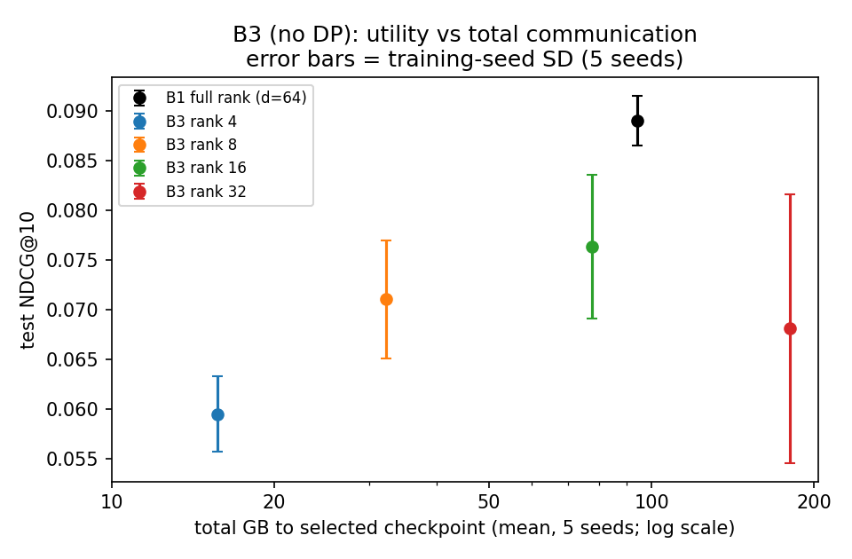

# B3 results: low-rank federated BPR, no DP

**Setup.** Low-rank shared item matrix Q = AB, with ranks 4/8/16/32 and d = 64. The model is trained with B1's objective
and convergence protocol: eval every 10 rounds, patience of 100 evaluations, a max_rounds ceiling of 8000, and
best-validation checkpoints. Five seeds (42/123/2026/7/99) are compared against B1 on the same five seeds; B1's seeds 7
and 99 are exact frozen replications (`results/raw/supplemental_b1/`). The tables are in `results/b34_*.csv`, and the
script is `experiments/analyse_b3b4.py`.

**Frozen settings (revision 2).** Local lr per rank is {4: 0.625, 8: 1.25, 16: 1.25, 32: 0.625}.

**Selection history** (validation only; recorded in RESEARCH_LOG):
1. The initial freeze used lr {4: 1.25, 32: 0.625}. It failed the gate: rank 4 diverged on 2 seeds, and rank 32 hit the
   cap on seed 123. It was superseded before any test exposure.
2. Correction 1 moved rank 32 to lr 1.25, which diverged on seed 123.
3. Revision 2 returned rank 32 to lr 0.625 and ran one convergence diagnostic for seed 123 with a 16000-round ceiling.
   That run stopped early at round 9350 (best round 8350). All other runs stopped early below the original 8000 ceiling.

Rank 32's lr is the expanded edge, chosen on a single seed (+0.0005). On seeds 2026 and 7, its BEST rounds were 620
and 800, and the runs stopped early at rounds 1620 and 1800 (validation 0.058/0.059). This looks like a plateau stop.

## Test NDCG@10 (mean ± seed SD, 5 seeds)

| Model | NDCG@10 | minus B1 (98.75% simultaneous CI) |
|---|---|---|
| B1, full rank | 0.0890 ± 0.0025 | — |
| B3 r4 | 0.0595 ± 0.0038 | −0.0295 [−0.0418, −0.0179] |
| B3 r8 | 0.0710 ± 0.0060 | −0.0180 [−0.0275, −0.0089] |
| B3 r16 | 0.0763 ± 0.0072 | −0.0127 [−0.0209, −0.0046] |
| B3 r32 | 0.0681 ± 0.0135 | −0.0209 [−0.0311, −0.0112] |

The CIs come from a paired user bootstrap: each user's score is averaged over the 5 seeds first, then 100,000 resamples
are drawn with seed 2026. They are conditional on these training runs. **Every rank is below B1 without DP.** There is no non-private support for low rank as a utility gain, and r32's total communication is 1.92× B1's.

## Communication

A smaller per-round payload does not mean less total traffic. Values are means over the 5 seeds.

All values are means over 5 seeds. The B1 row uses all 5 seeds (42/123/2026 plus the supplemental 7/99).

| Model | Payload, B/client/round (vs B1) | Rounds to best / run | GB to best checkpoint (vs B1) | GB, whole run |
|---|---|---|---|---|
| B1 | 861,184 (1×) | 1158 / 2158 | 93.9 (1.00×) | 174.9 |
| r4 | 55,872 (0.065×) | 2984 / 3984 | 15.7 (0.17×) | 21.0 |
| r8 | 111,744 (0.130×) | 3064 / 4064 | 32.3 (0.34×) | 42.8 |
| r16 | 223,488 (0.260×) | 3676 / 4676 | 77.4 (0.82×) | 98.4 |
| r32 | 446,976 (0.519×) | 4284 / 5284 | 180.3 (**1.92×**) | 222.3 |

The figure is also available as SVG (`results/plots/b3_utility_vs_total_comm.svg`). Error bars are the training-seed
SD.

See `results/b34_communication.csv` for the exact five-seed means. Low-rank models train for more rounds.

**Limits.** The ranks use different learning rates and stopping budgets, and the bootstrap is conditional on these
training runs. There was prior test exposure in earlier phases, so this is not a pristine holdout. No causal claim is
made about dimensionality alone.
