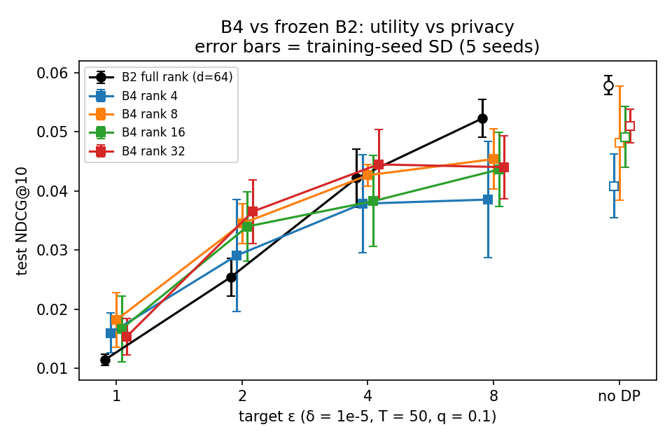

# B4 results: low-rank user-level DP federated BPR vs frozen B2

**Matched to final B2.** q 0.1, T 50, δ 1e-5, B2's PRV σ for ε ≈ 8/4/2/1 (RDP cross-check), fixed qN, one joint clip
over [ΔA, ΔB], noise on all D_r shared coordinates, balancing as post-processing. **DP scope.** The user-level (ε, δ) guarantee covers the B4 training mechanism *given the frozen hyperparameters*, and it
assumes secure aggregation: the server sees only the noised sum. Hyperparameter selection, validation and test
evaluation, and the research process as a whole are outside the guarantee. B4 does not claim that dimension reduces ε:
ε is identical to B2's by construction.

**Frozen settings** (C 1.0 for all ranks):

| Rank | local lr | η_s |
|---|---|---|
| 4 | 2.5 | 1 |
| 8 | 5 | 0.5 |
| 16 | 5 | 0.5 |
| 32 | 5 | 0.5 |

**Tuning history** (validation only; all stages retained):
1. **Superseded original protocol:** inherit B3's lr and take C from norm quantiles. Rejected because the inherited lr is
   near-random at round 50.
2. **Amended joint lr × C search** at ε 4 on seed 42 (63 cells).
3. **η_s check** at the step-2 winners.
4. **Five-seed stability screen**, which rejected those winners: their no-DP controls diverged.
5. **ONE bounded fallback:** C 1, lr {2.5, 5}, η_s {0.5, 1}, requiring all 25 jobs to finish and taking the best
   five-seed ε 4 validation mean.

**Low-rank therefore received a LARGER tuning budget than frozen B2.**

The rank per ε was selected on validation before any B4 test: noDP r32, ε 8 r8, ε 4 r32, ε 2 r16, ε 1 r16. Every
retained checkpoint was scored once (first real test at 19:16:38 +05:30, after the 19:14:35 freeze).

**Bottom line (primary, multiplicity-adjusted).** Only four of the 16 cells are reliably positive: r8, r16 and r32 at
ε 2, and r8 at ε 1. Every rank is worse than B2 at ε 8, and no reliable difference is detected at ε 4. There is no monotonic
best-rank trend. **This is limited support for H1,** conditional on a user bootstrap over five fixed training runs.

The validation-selected rank at ε 1 is r16. Its 95% CI against B2 is positive, but its adjusted CI includes 0, so it is
not a primary finding. It is not replaced by the test-best r8: no selection is made on test.

## Test NDCG@10 (mean ± training-seed SD, 5 seeds)

HR@10 and MRR@10 means and SDs are in `results/b34_test_means.csv`. Only NDCG@10 is bootstrapped, as declared.

The figure is also available as SVG (`results/plots/b4_utility_vs_epsilon.svg`). Error bars are the training-seed
SD.

| ε | B2 full rank | r4 | r8 | r16 | r32 |
|---|---|---|---|---|---|
| noDP | 0.0579 ± 0.0016 | 0.0408 ± 0.0054 | 0.0481 ± 0.0097 | 0.0491 ± 0.0052 | 0.0509 ± 0.0028 |
| 8 | 0.0523 ± 0.0032 | 0.0385 ± 0.0098 | 0.0454 ± 0.0051 | 0.0436 ± 0.0063 | 0.0440 ± 0.0053 |
| 4 | 0.0422 ± 0.0049 | 0.0378 ± 0.0083 | 0.0427 ± 0.0018 | 0.0383 ± 0.0077 | 0.0445 ± 0.0059 |
| 2 | 0.0254 ± 0.0032 | 0.0291 ± 0.0094 | 0.0345 ± 0.0034 | 0.0340 ± 0.0058 | 0.0365 ± 0.0054 |
| 1 | 0.0115 ± 0.0009 | 0.0160 ± 0.0034 | 0.0182 ± 0.0046 | 0.0167 ± 0.0056 | 0.0154 ± 0.0031 |

## B4 − B2 at matched ε

These are 16 contrasts with 99.6875% simultaneous CIs; `results/b34_contrasts.csv` also has the 95% intervals.

- **ε 8:** every rank is below B2 (r4 −0.0137, r8 −0.0069, r16 −0.0086, r32 −0.0082). All simultaneous CIs exclude 0.
- **ε 4:** no reliable difference from B2 was detected (r4 −0.0043, r8 +0.0005, r16 −0.0039, r32 +0.0023). All CIs
  include 0.
- **ε 2:** r8 (+0.0091), r16 (+0.0086) and r32 (+0.0111) are above B2, with simultaneous CIs above 0. r4 (+0.0037)
  includes 0.
- **ε 1:** r8 is +0.0067, with a simultaneous CI of [0.0005, 0.0136]. r4 (+0.0045), r16 (+0.0052) and r32 (+0.0039)
  include 0 under simultaneous CIs, although several 95% CIs exclude it.

## Popularity reference

The train-only popularity model scores 0.0443 test NDCG@10. This is a point reference: no paired significance test is
made against it.

- Every five-seed DP mean at ε ≤ 2, for both B2 and B4, is below the popularity point reference.
- At ε 4, B4 r32 is numerically close to it (0.0445 vs 0.0443).

So low-rank's gains over B2 under strong privacy do not surpass the train-only popularity reference.

## Secondary results

- **No-DP capacity:** every rank's no-DP control is below B2's no-DP control (r32 −0.0070 to r4 −0.0171).
- **DP loss against each model's own no-DP control:** at ε ≤ 4, every rank loses less than B2 does against its own
  no-DP control. At ε 4 the losses are −0.003 to −0.011, against B2's −0.0157. At ε 1 they are −0.025 to −0.036, against
  B2's −0.0464. At ε 8 the losses are comparable (r16 −0.0055, r32 −0.0069, B2 −0.0056). Low-rank starts from a lower
  no-DP baseline, so a smaller loss is not on its own evidence of an advantage.
- **Exact-settings diagnostic** (lr 5, C 1, η_s 1, ε 4): every rank's 95% CI against B2 includes 0.

## Interpretation limits

- This compares an *optimised low-rank model* with the *frozen full-rank B2*. The low-rank model had more tuning, so
  the comparison does not isolate the effect of dimensionality.
- The pattern fits a privacy–utility crossover: low-rank does worse at weak privacy (ε 8) and better at strong privacy
  (ε ≤ 2). This rests on one dataset, a fixed T 50, and bootstraps conditional on the training runs.
- There was prior test exposure in earlier phases; this is not a pristine holdout.
- **Raw factor noise is not effective-Q noise.** Balancing re-parameterises the factors but leaves AB unchanged
  (to float tolerance), so it does not alter Q. A noisy factor step changes Q as follows:

      (A + Z_A)(B + Z_B) = AB + Z_A B + A Z_B + Z_A Z_B

  So the effective noise in Q depends on the current factor scales and includes a second-order Z_A Z_B term. It is not
  set by D_r alone. For example, r4 at ε 1 has less raw noise per round than B2 (noise norm 249 vs 977; server-step
  noise 2.6 vs 10.4), yet its final mean item norm in Q is larger (2.00 vs 1.79). The final Q norm mixes signal,
  optimisation drift and accumulated noise, so it is **not** a direct measure of effective noise. Full diagnostics are in
  `results/b34_perturbation.csv`.
- **Confounds.** The two models differ in optimiser dynamics, local lr, η_s, balancing and tuning budget. No pure
  dimensional causal claim is possible.

## Communication (vs MATCHED B2, not long-horizon B1)

Both models run a fixed T 50, so the payload ratio and the total-volume ratio are equal. B2's mean total is 4.03 GB.

| Rank | Payload vs B2 | Total volume |
|---|---|---|
| r4 | 0.065× | 0.26 GB |
| r8 | 0.130× | 0.52 GB |
| r16 | 0.260× | 1.04 GB |
| r32 | 0.519× | 2.09 GB |

For the non-DP models (B3) the picture is different: r32 needs 1.92× B1's total volume to reach its best round,
because it trains longer.
