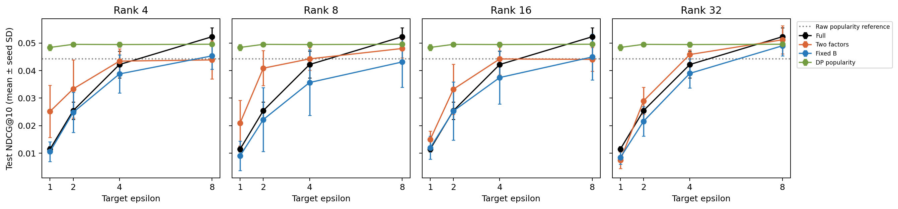
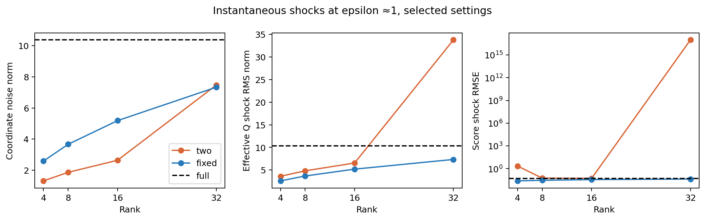

# E1 results: fixed public factor, effective noise and DP popularity

Completed 2026-10-02. **The fixed-factor baseline does not improve the private
recommendation tradeoff under this protocol.** None of sixteen primary contrasts
against two-factor training is reliably positive; eight are reliably negative
after multiplicity correction. A user-level DP popularity baseline is stronger
in point estimates than every collaborative model here at epsilon <=4.

The mechanism analysis is useful despite that outcome: the bilinear noise term
is small in these runs, local user norms can amplify score shocks severely, and
clipping/optimization changes are substantial. The experiment does not establish
that removing the bilinear term alone causes either improvement or deterioration.

## What was run and preserved

B0–B4, all historical outputs, the split and evaluator remain unchanged: **3932
protected code/config/test/result/checkpoint/data files match their initial
SHA-256 hashes**. E1 uses separately named outputs and retained checkpoints.
The predeclared protocol is [here](EFFECTIVE_NOISE_PROTOCOL.md); the derivations
are in [the theory note](EFFECTIVE_NOISE_THEORY.md), and the novelty audit is in
[research positioning](RESEARCH_POSITIONING.md).

E1-Full is the existing full-rank mechanism with the same initialization.
E1-Two trains both factors with a joint clip and balancing. E1-FixedB fixes a
data-independent orthonormal latent B and privately trains A. Local p_u stays
64-dimensional and on-device. Two and FixedB start with the same effective Q
and P at each rank; Two's initial balancing changes its coordinates. This common
initialization differs from historical B4 and is explicitly an extension.

All use q=.1, T=50, E=2, L2=1e-5, C=1 and fixed qN. Training noise matches B2
exactly: achieved PRV epsilon 7.9675/3.9639/1.9933/.9901 for targets 8/4/2/1;
delta=1e-5, RDP cross-check. Four candidate (local lr, server lr) pairs per model
unit, three selection seeds, six levels including unclipped/no-noise and
clipping-only, give **648 search jobs**. Eleven failed trajectories remain in
the record. All nine model units have eligible candidates.

Selection at final-round eps4 validation gives local lr5 for all methods;
server lr1 for Full, FixedB at every rank, and Two r32; Two r4/r8/r16 use .5.
FixedB's rate is at the upper declared grid edge. The grid was not expanded.
Five-seed confirmation produces **270 finite round-50 training states**.
Selected search jobs are reused, so there are 756 unique training records
including failures, rather than 918 new training runs. No early stopping.

Freeze `20261002T153741Z` preceded first extension test output at
`2026-10-02T15:38:44.686919Z`. Each of the 270 training checkpoints and 21
popularity score arrays was scored once; analysis reads saved per-user ranks.
The ML-100K test already had historical exposure and remains a development
benchmark. Finiteness is the declared gate, not a guarantee of well-conditioned
training: some Two trajectories have very large local state and are retained.

## Test NDCG@10

Means across five seeds 42/123/2026/7/99; this table omits SD for compactness.
Exact means, seed SD, HR@10 and MRR@10 are in
[`test_means.csv`](../../results/extensions/effective_noise_v1/test_means.csv).
HR@10 equals Recall@10 and is not separate evidence.

| Model | No DP, unclipped | Clipping only | eps8 | eps4 | eps2 | eps1 |
|---|---:|---:|---:|---:|---:|---:|
| Full | .057889 | .058846 | .052271 | .042169 | .025428 | .011461 |
| Two r4 | .042086 | .045605 | .043854 | .043413 | .033318 | .025136 |
| FixedB r4 | .052112 | .050434 | .045312 | .038760 | .024798 | .010535 |
| Two r8 | .050917 | .048512 | .047996 | .044229 | .040841 | .020965 |
| FixedB r8 | .055971 | .054849 | .043096 | .035640 | .022179 | .009042 |
| Two r16 | .050635 | .045217 | .044047 | .044199 | .033219 | .014960 |
| FixedB r16 | .055159 | .054618 | .044923 | .037443 | .025286 | .011958 |
| Two r32 | .048614 | .051793 | .051158 | .045807 | .028967 | .007427 |
| FixedB r32 | .056432 | .055807 | .048978 | .038959 | .021559 | .008385 |

The full-rank selected settings reproduce the historical five-seed B2 means
to reported precision. FixedB is higher than Two without noise at every rank
in point estimates, so a hard rank-capacity argument alone does not explain its
private disadvantage. Its private utility declines sharply despite the linear
noise map. These are short-horizon results, not converged-model comparisons.

## Primary paired comparisons

For each user, average NDCG over the five training seeds first; then use 100000
common paired user-bootstrap resamples, seed 2026. The intervals below are
99.6875% Bonferroni intervals for the sixteen FixedB-minus-Two contrasts.
They are conditional on these training runs; training-seed differences are
retained separately, and these are not joint population-and-seed intervals.

| Rank | eps8 difference [adjusted CI] | eps4 | eps2 | eps1 |
|---|---|---|---|---|
| 4 | +.00146 [−.00438,+.00718] | −.00465 [−.01245,+.00271] | **−.00852 [−.01668,−.00104]** | **−.01460 [−.02192,−.00794]** |
| 8 | −.00490 [−.01099,+.00105] | **−.00859 [−.01587,−.00158]** | **−.01866 [−.02770,−.01037]** | **−.01192 [−.01839,−.00595]** |
| 16 | +.00088 [−.00466,+.00641] | **−.00676 [−.01363,−.00032]** | **−.00793 [−.01560,−.00073]** | −.00300 [−.00884,+.00244] |
| 32 | −.00218 [−.00925,+.00450] | −.00685 [−.01464,+.00057] | **−.00741 [−.01372,−.00116]** | +.00096 [−.00312,+.00501] |

No positive adjusted contrast is detected. In particular, all four ranks lose
at eps2. The largest negative mean is r8/eps2: −.018662. Failure to detect a
difference in the other eight cells is not evidence of equivalence.

Validation selects FixedB ranks 32/32/16/16 at eps8/4/2/1 and Two ranks
32/32/8/4. The corresponding test means are:

| Target eps | Full | Selected Two | Selected FixedB | DP popularity |
|---|---:|---:|---:|---:|
| 8 | .052271 | .051158 (r32) | .048978 (r32) | .049548 |
| 4 | .042169 | .045807 (r32) | .038959 (r32) | .049428 |
| 2 | .025428 | .040841 (r8) | .025286 (r16) | .049507 |
| 1 | .011461 | .025136 (r4) | .011958 (r16) | .048389 |

Those selected-rank contrasts are secondary. Ranks are never reselected using
test. Saved historical B4 per-user outputs give additional secondary comparisons:
FixedB is numerically above B4 at eps8 for r4/r16/r32, but below every B4 rank
at eps2 and eps1. Initialization and tuning differ, and the unadjusted historical
intervals must not be presented as primary discoveries.

## DP popularity changes the practical reference

Each user contributes a binary vector of unique TRAIN positives, clipped in L2
to sqrt(20). One full-population Gaussian release has entire-user add/remove
sensitivity sqrt(20), q=1 and T=1. The analytic Gaussian noise multiplier is
.600229/1.081162/1.993812/3.730632 at eps8/4/2/1. This is separate accounting
from 50-round training, not reuse of B2's sigma. Both meet the stated common
target privacy bound; training's achieved PRV values are slightly tighter.

| Popularity scorer | Test NDCG@10 | Seed SD |
|---|---:|---:|
| Existing raw counts, non-private point reference | .044292 | — |
| Bounded user contributions, no noise | .049885 | deterministic |
| DP eps8 | .049548 | .000544 |
| DP eps4 | .049428 | .000890 |
| DP eps2 | .049507 | .000635 |
| DP eps1 | .048389 | .001125 |

The bounded scorer also changes user weighting; its advantage over raw counts
must not be attributed to DP. At eps1 it retains 97.0% of its bounded no-noise
control in point estimates. Every FixedB-minus-DPPop secondary 95% interval at
eps<=4 is negative; this family is exploratory and unadjusted. All collaborative
means at these privacy levels are lower, including Two's largest eps2 mean.
The baseline does not learn a personalized collaborative representation.

## What the geometry actually shows

Diagnostics hold the just-updated local P fixed and compare each noisy server
step against its own signal-only counterfactual. They measure an instantaneous
shock, not cumulative training noise. In float64:

    E||delta Q||² = tau²(M||B_s||² + d||A_s||²) + Mdr tau⁴,
    E||P delta Qᵀ||² = tau²(M||PB_sᵀ||² + ||A_s||²||P||²)
                      + Mr tau⁴||P||².

The fixed orthonormal basis removes the B-noise and bilinear terms and makes
A→AB an isometry. It is also equivalent in scores to ordinary rank-r BPR with
local v_u=Bp_u, so it is an established linear baseline rather than a new
expressive model. Synthetic Monte Carlo matrix/score energy ratios lie between
.997 and 1.003 with 2000 draws per cell.

At selected settings, the expected bilinear contribution is only **.207%,
.232%, .251%, .301%** of total matrix-shock energy at eps1 for Two r4/8/16/32.
It is therefore inaccurate to claim that this term dominates E1's failures.
Linear factor scale and the evolving local P matter more here. Balancing
preserves the already noisy AB and cannot remove a realized shock; equal-norm
balancing also need not minimize matrix-size-weighted or score-weighted noise.

| Model at eps1 | Q shock RMS norm | Score-shock RMSE, mean over probe rounds/seeds | Random-margin sign flips |
|---|---:|---:|---:|
| Full | 10.369 | .05110 | .1530 |
| Two r4 | 3.602 | 2.24758 | .0967 |
| FixedB r4 | 2.592 | .02450 | .1038 |
| Two r8 | 4.817 | .05554 | .1070 |
| FixedB r8 | 3.667 | .02912 | .1181 |
| Two r16 | 6.542 | .05266 | .1144 |
| FixedB r16 | 5.186 | .03594 | .1314 |
| Two r32 | 33.788 | 9.85e16 | .1573 |
| FixedB r32 | 7.333 | .04271 | .1433 |

Q RMS is the square root of mean per-round energy per run, then averaged over
seeds. Scores/margins use rounds 1/10/25/50 and 256 public random item pairs.
The large Two r4/r32 score values are real retained outliers, not evidence of
consistent scale across seeds. Two r32/eps1/seed123 has a local maximum norm
about 2.91e20; finite state does not imply useful numerical conditioning.
The frozen runner's float32 norm overflow was corrected **only in analysis**
by computing final norms from saved P in float64. Original logs/code and the
earlier diagnostic tables are archived. No training or test rank changed.

Smaller absolute score shocks do not imply better ranking. At r8/eps1, for
example, FixedB's absolute score RMSE is smaller, but its relative score shock
is .445 versus Two's .352, random-margin flip fraction is .118 versus .107,
and its test NDCG is lower. The clean signal and margins differ between
trajectories. At eps4, selected FixedB r4/r8/r16 even has larger Q shocks than
Two, since its server rate is twice as large. Raw coordinate count alone misses
that difference.

Clipping is also different in effect: r8/eps1 clips 32.0% of FixedB clients
versus 56.5% of Two clients, while effective signal-step norm averages .087
versus .179. Clipping-only controls and secondary comparisons are in
[`contrasts.csv`](../../results/extensions/effective_noise_v1/contrasts.csv).
These diagnostics are consistent with coupled optimization/signal/noise
effects; they do not identify one causal source of the utility gap.

## Personalization, activity and cold targets

Validation-only own/permuted/mean-P ablations suggest weak personalized gains
at this short private horizon. FixedB r16 at eps1 scores .01198 with its own P,
.00977 with permuted P, and .02420 with one mean P. That mean-P scorer is a
research diagnostic involving private local states, **not a deployable DP baseline**.
There is no significance test for these ablations.

For the validation-selected eps1 configurations, test NDCG by low/medium/high
activity is .0111/.0103/.0145 for FixedB r16, .0266/.0223/.0264 for Two r4,
and .0558/.0356/.0536 for DPPop. The groups contain 319/310/313 users, using
predeclared train-positive cutoffs <=22, 23–61, >=62. These are descriptive.
There are only fourteen cold test targets; the validation-selected factor models
score zero on them, while a few other/noisy cells have isolated hits. This does not
support a cold-item benefit or motivate choosing a model from that subgroup.

## Dense communication

Simulated float32 uploads plus downloads, with realized participation, common
T50. Public B can be reproduced from its seed; explicit B provisioning costs
4dr bytes/client once and is separate from the table.

| Rank | Two bytes/client/round | FixedB bytes/client/round | Two total GB | FixedB total GB |
|---|---:|---:|---:|---:|
| 4 | 55,872 | 53,824 | .26119 | .25162 |
| 8 | 111,744 | 107,648 | .52238 | .50323 |
| 16 | 223,488 | 215,296 | 1.04476 | 1.00647 |
| 32 | 446,976 | 430,592 | 2.08952 | 2.01293 |

Full uses 861,184 bytes/client/round and 4.02586 GB. Fixing B saves only 3.67%
relative to Two at the same rank; the large saving relative to full rank comes
from rank reduction. These are tensor volumes, not measured network traffic.
Equal T does not establish superiority at an equal communication budget.

## Research decision

Preserve E1 as a negative fixed-factor result with a useful mechanism analysis.
Do not expand the grid after viewing test, exclude finite amplified trajectories,
or market the bilinear term as the established dominant cause. A next study
should control effective shared-step scale separately from local personalization,
then replicate on an independently reserved larger benchmark and compare total
communication budgets with fresh per-horizon privacy accounting. Public metadata
residuals remain a separately named direction 3 extension.

The per-run training guarantees assume frozen hyperparameters and a server
observing only the noised aggregate under assumed secure aggregation. Local
checkpoints, selection, diagnostics, evaluation and the joint release of all
experimental runs are outside that guarantee. Seeded noise is reproducible, not
cryptographic. A fixed-factor application or these moment identities alone are
not sufficient novelty, as discussed in the prior-art audit.

Artifacts and commands are indexed in
[`results/extensions/effective_noise_v1/README.md`](../../results/extensions/effective_noise_v1/README.md).
